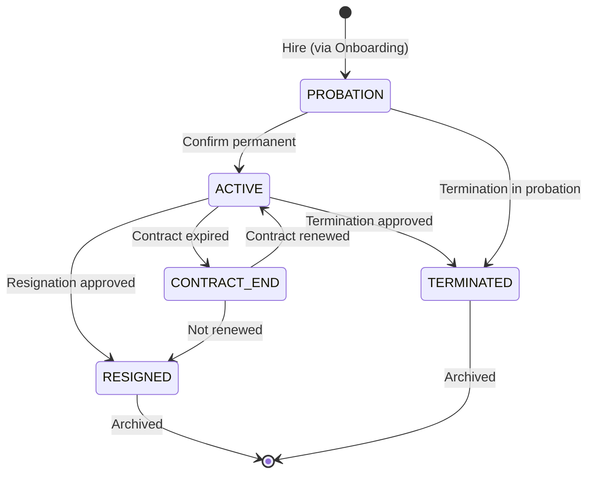

# Module 6.2 — Master Employee

> Detail operasional modul Master Employee
> Referensi utama: `prd.md` section 6.2, `fix-prd.md` section 3.2, `MODULE-DETAIL-GAP-GUIDE.md`
> Status: draft refinement
> Tanggal: 2026-06-30

---

## 1. Ringkasan

### Tujuan Bisnis

Master Employee adalah **sumber kebenaran tunggal (single source of truth)** untuk seluruh data karyawan di perusahaan — dari data pribadi, data kepegawaian, hingga data penggajian. Semua modul lain (Payroll, Attendance, Leave, Performance, Recruitment, Onboarding, Benefit, Loan, Travel, DMS) mereferensi data karyawan dari modul ini.

### Masalah yang Diselesaikan

- data karyawan tersebar di banyak sistem/file Excel
- tidak ada riwayat perubahan data yang jelas (mutasi, promosi, demosi)
- perubahan data sensitif (gaji, rekening) tidak melalui approval yang memadai
- NIK tidak standar dan sulit dilacak antar company dalam grup
- dokumen karyawan tidak terpusat

### Dependency Modul

- `6.1 Authentication & Authorization` — akun login terikat ke employee
- `6.3 Organization Structure` — department, position, branch referensi
- `6.6 Attendance` — kehadiran per karyawan
- `6.7 Leave Management` — saldo & pengajuan cuti
- `6.9 Payroll` — gaji, BPJS, bank
- `6.10 Performance Management` — review & goal per karyawan
- `6.15 Onboarding & Offboarding` — aktivasi & non-aktivasi
- `6.19 Employee Loan` — pinjaman karyawan
- `6.20 Travel & Expense` — perjalanan dinas
- `6.24 Document Management` — dokumen karyawan

---

## 2. Aktor dan Hak Akses

### Aktor Utama

- `Group Super Admin` — akses ke seluruh company dalam group
- `Super Admin` — akses penuh di company sendiri
- `HR Manager` — CRUD + approval perubahan sensitif
- `HR Staff` — CRU (create, read, update) data operasional, tidak bisa gaji/rekening
- `Manager` — view data anggota tim, tidak bisa edit
- `Employee` — view data diri sendiri, edit data terbatas (kontak, alamat)

### Akses Minimum per Role

| Role | List | Detail | Create | Edit Umum | Edit Gaji/Rekening | Edit Status | Delete | Import/Export |
|------|:---:|:------:|:------:|:---------:|:------------------:|:-----------:|:------:|:-------------:|
| Group Super Admin | ✅ All | ✅ | ✅ | ✅ | ✅ | ✅ | ✅ | ✅ |
| Super Admin | ✅ Company | ✅ | ✅ | ✅ | ✅ | ✅ | ✅ | ✅ |
| HR Manager | ✅ Company | ✅ | ✅ | ✅ | ✅ with approval | ✅ | ✅ | ✅ |
| HR Staff | ✅ Company | ✅ | ✅ | ✅ | ❌ | ❌ | ❌ | ✅ |
| Manager | ✅ Tim | ✅ Tim | ❌ | ❌ | ❌ | ❌ | ❌ | ❌ |
| Employee | ❌ | ✅ Self | ❌ | ✅ Terbatas | ❌ | ❌ | ❌ | ❌ |

### Scope Akses

- Seluruh query difilter oleh `company_id` user
- `Group` role bisa melihat karyawan lintas company dalam group
- `Manager` hanya melihat karyawan di departemen yang dipimpinnya
- `Employee` hanya bisa mengakses data dirinya sendiri

### Menu Visibility

- `Admin/HR` melihat menu penuh: List, Create, Import, Export
- `Manager` melihat menu terbatas: List tim, detail anggota
- `Employee` tidak melihat menu Employee di sidebar, akses via Profile/Self Service

---

## 3. Entitas dan Data

### Entitas Utama

| Entity | Deskripsi |
|--------|-----------|
| `Employee` | Data master karyawan |
| `EmployeeCareerTransaction` | Riwayat mutasi, promosi, demosi |

### Field Penting di Employee

**Data Pribadi:**
- `id`, `employeeNumber` (NIK auto-generate), `firstName`, `lastName`, `fullName`
- `email`, `phone`
- `idNumber` (No. KTP), `placeOfBirth`, `dateOfBirth`
- `gender`, `religion`, `maritalStatus`, `bloodType`, `nationality`
- `address`, `avatar`

**Data Kepegawaian:**
- `companyId`, `branchId`, `departmentId`, `subDepartmentId`, `positionId`
- `joinDate`, `employmentStatus` (ACTIVE, RESIGNED, TERMINATED, PROBATION, CONTRACT_END)
- `employmentType` (PERMANENT, CONTRACT, INTERN, PROBATION, FREELANCE, OUTSOURCING)

**Data Penggajian:**
- `bankName`, `bankAccount`, `bankAccountHolder`
- `taxId` (NPWP)
- `bpjsKetenagakerjaan`, `bpjsKesehatan`

### Data Sensitif (Perlu Proteksi Khusus)

- Gaji dan komponennya — hanya HR Manager/Finance
- No. Rekening bank — masking di view non-privileged
- NPWP — hanya untuk payroll & tax reporting
- KTP — hanya untuk HR & Legal
- BPJS — untuk enrollment benefit

### Relasi Penting

- Employee → Company (setiap karyawan terikat ke satu legal entity)
- Employee → Department / Position / Branch (penempatan organisasi)
- Employee → User (akun login, bisa null untuk calon pegawai)
- Employee → EmployeeCareerTransaction (riwayat perubahan)
- Employee → Attendance, LeaveRequest, Loan, BusinessTrip (data transaksional)

---

## 4. Status

### Status Karyawan (`employmentStatus`)

| Status | Arti |
|--------|------|
| `ACTIVE` | Karyawan aktif bekerja |
| `PROBATION` | Masa percobaan |
| `CONTRACT_END` | Kontrak berakhir (masa tenggang) |
| `RESIGNED` | Mengundurkan diri |
| `TERMINATED` | PHK |

### Transisi Status



### Locking Rule

- NIK tidak bisa diubah setelah dikonfirmasi
- Karyawan dengan status RESIGNED/TERMINATED tidak bisa diedit data sensitifnya
- Data payroll final tidak bisa diubah untuk periode yang sudah dikunci
- Dokumen legal (kontrak, KTP, NPWP) tidak bisa dihapus, hanya bisa diganti versi baru

---

## 5. Alur Utama

### A. Create Karyawan Baru (fix-prd §3.2)

1. HR Staff/Manager membuka Employee → "Tambah Karyawan Baru".
2. Input data pribadi, kepegawaian, dan penggajian.
3. NIK auto-generate berdasarkan format konfigurabel per company.
4. Sistem validasi: NIK unique, email unique, semua field wajib diisi.
5. Departemen/posisi/branch valid terhadap struktur organisasi aktif.
6. Data tersimpan dengan status `PROBATION` atau `ACTIVE`.
7. Audit Log mencatat aksi CREATE.
8. Jika dari flow Onboarding, data sudah terisi dari data kandidat yang di-hire.

### B. Update Data Karyawan

1. HR membuka detail karyawan.
2. Edit field yang diizinkan.
3. **[Jika data sensitif (gaji, rekening)]** → approval workflow dijalankan.
4. Riwayat perubahan tercatat di `EmployeeCareerTransaction`.
5. Notifikasi ke karyawan jika data yang berubah adalah data pribadi.
6. Audit Log mencatat field before/after.

### C. Mutasi/Promosi

1. HR membuka halaman mutasi karyawan.
2. Pilih jenis: Promosi, Demosi, Mutasi (internal), Transfer (lintas company).
3. Tentukan unit/posisi baru.
4. Atur tanggal efektif.
5. Approval jika diperlukan (mutasi lintas company butuh Group approval).
6. Setelah approval, data karyawan diperbarui.
7. `EmployeeCareerTransaction` tercatat.
8. Notifikasi ke atasan lama & baru.

### D. Resign / Non-aktif

1. Resignation diajukan melalui modul Onboarding/Offboarding.
2. Proses exit clearance dijalankan.
3. Setelah clearance selesai, status karyawan menjadi `RESIGNED`.
4. Data tetap tersimpan (soft delete), tidak bisa diedit lagi.
5. Akun user di-nonaktifkan.

---

## 6. Alur Alternatif / Exception

### Import Gagal (Bulk via CSV/Excel)

- Baris dengan data tidak valid dilewati, error dicatat per baris
- User bisa download error report untuk koreksi
- Import bisa di-rollback jika belum di-commit

### Duplicate Terdeteksi

- NIK/email duplikat → sistem tolak dengan pesan
- Employee dengan NIK sama dari company berbeda → diizinkan (NIK unique per scope)

### Perubahan Gaji Tanpa Approval

- HR Staff coba ubah gaji → sistem blok, tampil pesan "perlu approval HR Manager"
- Perubahan masuk ke queue approval

### Data Tidak Lengkap

- Karyawan tanpa posisi → ditandai "belum placement"
- Karyawan tanpa atasan → ditandai "belum ada reporting line"

---

## 7. Validasi dan Business Rules

### Validasi Data Wajib

- `employeeNumber` (auto, unique), `firstName`, `lastName`, `fullName`
- `companyId`, `email`, `joinDate`
- `employmentType`, `employmentStatus`

### Validasi Kepegawaian

- Departemen/posisi/branch harus merupakan entity aktif di struktur organisasi
- Tipe kontrak harus sesuai dengan status: PROBATION → CONTRACT, ACTIVE → PERMANENT
- Tanggal kontrak berakhir wajib untuk tipe CONTRACT

### Validasi NIK

- Format: konfigurabel per company, contoh: `YYYYMM-XXX`
- Auto-generate, tidak bisa diubah manual setelah tersimpan
- Unique dalam satu company

### Rule Perubahan

- Perubahan data sensitif (gaji, rekening, NPWP) memerlukan approval HR Manager
- Perubahan departemen/posisi mencatat `EmployeeCareerTransaction`
- Status resign/terminated tidak bisa dikembalikan ke aktif tanpa approval khusus

### Rule Company Scope

- Karyawan hanya terikat ke satu company (primary assignment)
- Secondment lintas company dicatat sebagai riwayat, bukan pindah company
- Karyawan yang di-secondment tetap memiliki company asal

---

## 8. UI/UX

### Halaman Minimum

| Halaman | Route | Fungsi |
|---------|-------|--------|
| Employee List | `/employees` | Daftar karyawan dengan filter, search, pagination |
| Employee Detail | `/employees/:id` | Profil lengkap, tabs per kategori data |
| Employee Create/Edit | `/employees/new`, `/employees/:id/edit` | Form input data |
| Import | (modal di list) | Upload CSV dengan preview & mapping |

### List Page

- **Search** by name, NIK, email, department
- **Filter** by status, department, position, employment type, branch
- **Sort** by name, NIK, join date, department
- **Pagination** (25/50/100 per page)
- **Bulk actions** (export selected, activate/deactivate)
- **Column toggles** untuk show/hide kolom
- **Avatar** thumbnail per row

### Detail Page

- **Header:** Avatar, Nama, NIK, Status badge
- **Tab: Data Pribadi** — KTP, tempat/tgl lahir, agama, alamat, kontak
- **Tab: Data Kepegawaian** — departemen, posisi, atasan, tipe kontrak, join date
- **Tab: Data Penggajian** — bank, NPWP, BPJS (masking untuk role tertentu)
- **Tab: Riwayat** — mutasi, promosi, perubahan data
- **Tab: Dokumen** — link ke DMS (future)
- **Action buttons:** Edit, Mutasi, Non-aktifkan

### Form Create/Edit

- **Wizard** untuk create: Step 1 (pribadi) → Step 2 (kepegawaian) → Step 3 (penggajian)
- **Single page** untuk edit dengan section collapsible
- **Dropdown** untuk department/position/branch yang terfilter oleh company
- **Date picker** untuk tanggal lahir, join date
- **Auto-calculate** fullName dari firstName + lastName

### Empty State

- "Belum ada data karyawan. Import atau tambah karyawan baru."
- "Tidak ada hasil ditemukan untuk filter yang dipilih."
- "Belum ada riwayat perubahan untuk karyawan ini."

### Loading State

- Table skeleton (5-10 rows)
- Card skeleton untuk detail page
- Progress bar untuk import CSV

### Error State

- Form validation inline per field
- Toast error untuk operasi gagal
- Error banner untuk import CSV (dengan detail per baris)
- "Karyawan tidak ditemukan" untuk invalid ID

---

## 9. API Contract

### Endpoint yang Tersedia

| Method | Endpoint | Deskripsi |
|--------|----------|-----------|
| GET | `/api/employees` | List karyawan (search, filter, pagination) |
| POST | `/api/employees` | Create karyawan baru |
| GET | `/api/employees/:id` | Detail karyawan |
| PATCH | `/api/employees/:id` | Update data karyawan |
| DELETE | `/api/employees/:id` | Nonaktifkan (soft delete) |
| PATCH | `/api/employees/:id/activate` | Aktifkan kembali |
| GET | `/api/employees/:id/history` | Riwayat perubahan |
| POST | `/api/employees/import` | Import bulk via CSV/Excel |
| GET | `/api/employees/export` | Export data karyawan |

### Response Shape

```json
{
  "id": "uuid",
  "employeeNumber": "202606-001",
  "firstName": "Budi",
  "lastName": "Santoso",
  "fullName": "Budi Santoso",
  "email": "budi@company.com",
  "companyId": "uuid",
  "department": { "id": "uuid", "name": "Human Capital" },
  "position": { "id": "uuid", "name": "HR Staff" },
  "employmentStatus": "ACTIVE",
  "employmentType": "PERMANENT",
  "joinDate": "2024-01-15",
  "bankName": "BCA",
  "bankAccount": "****1234",
  "createdAt": "2024-01-15T00:00:00Z"
}
```

### Error yang Mungkin Muncul

| HTTP | Code | Skenario |
|------|------|----------|
| 400 | VALIDATION_ERROR | Field wajib tidak diisi, format salah |
| 400 | DUPLICATE_NIK | NIK sudah terpakai |
| 400 | DUPLICATE_EMAIL | Email sudah terdaftar |
| 401 | UNAUTHORIZED | Belum login |
| 403 | FORBIDDEN | Tidak punya akses |
| 404 | NOT_FOUND | Karyawan tidak ditemukan |
| 422 | INVALID_REFERENCE | Department/position tidak valid |
| 409 | SENSITIVE_DATA | Perubahan gaji/rekening perlu approval |

---

## 10. Workflow / Approval

### Perubahan yang Perlu Approval

| Jenis Perubahan | Approver | Workflow Engine |
|----------------|----------|:---------------:|
| Edit gaji & komponen | HR Manager | ✅ Perlu |
| Edit rekening bank | HR Manager | ✅ Perlu |
| Ubah status karyawan | HR Manager + Company Admin | ✅ Perlu |
| Mutasi antar company | Group Super Admin | ✅ Perlu |
| Resign/Terminate | HR Manager | ✅ Perlu (via Offboarding) |
| Edit data pribadi | HR Staff (langsung, tanpa approval) | ❌ |

### Alur Approval

- Perubahan sensitif: `HR Staff request → HR Manager approve/reject`
- Mutasi lintas company: `HR Manager asal → HR Manager tujuan → Group HR Director`
- Workflow Engine template: `employee-data-change`

### SLA

- Perubahan data sensitif: 1 hari kerja
- Mutasi: 2-3 hari kerja
- Resign/Terminate: sesuai notice period

---

## 11. Notification

### Trigger

| Event | Penerima | Channel |
|-------|----------|---------|
| Karyawan baru dibuat | HR Manager, atasan langsung | In-app, Email |
| Data karyawan diubah | Karyawan (untuk data pribadi) | In-app |
| Perubahan sensitif butuh approval | HR Manager | In-app, Email |
| Perubahan disetujui/ditolak | Pembuat request | In-app |
| Karyawan resign/terminated | HR, IT, GA, Finance | In-app, Email |
| Kontrak akan berakhir (H-30) | HR, karyawan | In-app, Email |
| Kontrak expired | HR | In-app |

---

## 12. Audit Log

### Aksi yang Wajib Di-log

| Aksi | Detail |
|------|--------|
| CREATE employee | Actor, NIK, nama lengkap |
| UPDATE data pribadi | Actor, field before/after |
| UPDATE data kepegawaian | Actor, department/position before/after |
| UPDATE data sensitif | Actor, "salary/bank updated" (tanpa nilai) |
| ACTIVATE / DEACTIVATE | Actor, old/new status |
| IMPORT bulk | Actor, jumlah sukses, jumlah gagal |
| EXPORT data | Actor, filter yang dipakai |

### Data yang Dimasking

- Nomor rekening — hanya 4 digit terakhir tampil
- Gaji — hanya role HR Manager/Finance yang bisa lihat nominal
- NPWP — hanya untuk payroll & tax
- KTP — hanya untuk HR & Legal

---

## 13. Reporting

### Dashboard / Widget

| Widget | Sumber Data | Role |
|--------|-------------|------|
| Headcount per company | Employee (group by companyId) | Group Super Admin |
| Headcount per departemen | Employee (group by departmentId) | HR Manager |
| Status distribusi (Aktif/Probasi/Kontrak) | Employee | HR Manager |
| Tipe employment distribusi | Employee | HR Manager |
| Turnover rate (dalam periode) | Employee + Resignation | HR Manager |
| Kontrak akan expired H-30 | Employee | HR Staff |
| Rata-rata masa kerja | Employee | HR Manager |

### Export

- Daftar karyawan (CSV/Excel/PDF) — dengan filter
- Data payroll dasar (CSV) — untuk finance
- Kartu karyawan (PDF) — data ringkas per orang
- Import template (CSV/Excel) — untuk persiapan import

---

## 14. Seed / Demo Scenario

### Data Minimum

| Entity | Jumlah | Catatan |
|--------|:------:|---------|
| Employee | 20 | 2 company × 10 karyawan |
| Status ACTIVE | 15 | Sebagian besar |
| Status PROBATION | 3 | Karyawan baru |
| Status CONTRACT_END | 1 | Kontrak akan habis |
| Status RESIGNED | 1 | Riwayat |
| Tipe PERMANENT | 12 | |
| Tipe CONTRACT | 5 | |
| Tipe INTERN | 2 | |
| Tipe FREELANCE | 1 | |

### Happy Path

1. HR Staff buka Employee List → lihat 20 karyawan dengan pagination
2. Klik salah satu → lihat detail lengkap dengan tabs
3. HR Manager buka form create → isi data step by step → save
4. HR Staff buka import → upload CSV → lihat progress bar → sukses
5. Manager buka halaman → lihat hanya timnya sendiri

### Reject Path

1. HR Staff coba ubah gaji karyawan → sistem minta approval
2. Coba buat employee dengan NIK duplikat → error validasi
3. Coba assign ke departemen yang sudah inactive → error
4. Coba delete employee yang masih aktif → sistem tolak (soft delete)

---

## 15. Open Questions

1. Apakah perlu workflow approval untuk perubahan alamat/telepon/email?
2. Apakah employee bisa memiliki multiple assignment (multi-position)?
3. Apakah perlu fitur "mass update" untuk perubahan data batch?
4. Bagaimana handling employee yang pindah company dalam grup (secondment vs transfer)?
5. Apakah perlu mendukung dokumen employee langsung upload tanpa DMS?
6. Format NIK auto-generate seperti apa yang paling fleksibel per company?

---

## 16. Acceptance Criteria

- [ ] CRUD Employee berfungsi penuh dengan validasi
- [ ] NIK auto-generate dengan format konfigurabel
- [ ] Validasi NIK unique per company
- [ ] Validasi email unique
- [ ] Filter & search di list page berfungsi
- [ ] Pagination (25/50/100) berfungsi
- [ ] Detail page dengan tabs (pribadi, kepegawaian, penggajian, riwayat)
- [ ] Import CSV/Excel dengan error reporting
- [ ] Export CSV/Excel dengan filter
- [ ] Role-based access control berfungsi (HR vs Manager vs Employee)
- [ ] Data sensitif termasking untuk role non-privileged
- [ ] EmployeeCareerTransaction tercatat untuk mutasi/promosi
- [ ] Soft delete (tidak bisa hard delete)
- [ ] Integrasi dengan Organization Structure (departemen/posisi aktif)
- [ ] Seed data menampilkan scenario realistis

---

## 17. Scope Implementasi Bertahap

### Phase 1 (✅ Selesai)

- CRUD Employee dasar
- Employee List dengan search, filter, pagination
- Employee Detail dengan semua informasi
- Employee Form (create/edit)
- Validasi dasar
- Role-based access control
- Soft delete

### Phase 2

- Import CSV/Excel dengan error reporting
- Export CSV/Excel
- EmployeeCareerTransaction (riwayat mutasi/promosi)
- Integrasi approval workflow untuk data sensitif
- Data masking untuk role non-privileged

### Phase 3

- Bulk actions (mass update, mass activate)
- Advanced search (fuzzy search, multi-criteria)
- Employee document integration ke DMS
- Secondment & intercompany transfer workflow
- Data quality dashboard (incomplete data, duplicate detection)

---

## 18. Catatan Implementasi

Master Employee adalah modul yang **paling kritis untuk data quality** karena semua modul lain bergantung padanya.

- Selalu validasi referensi ke Organization Structure sebelum menyimpan karyawan
- Gunakan soft delete — jangan pernah hard delete data karyawan
- NIK harus unique dan immutable setelah disimpan
- Audit log untuk perubahan data sensitif wajib detail
- Pertimbangkan data synchronization jika ada integrasi dengan sistem eksternal (payroll, BPJS, bank)
- Form import/export harus handle berbagai format encoding (UTF-8, Windows-1252 untuk Excel Indonesia)
- Untuk production, pertimbangkan fitur "data lock" untuk periode payroll tertentu
