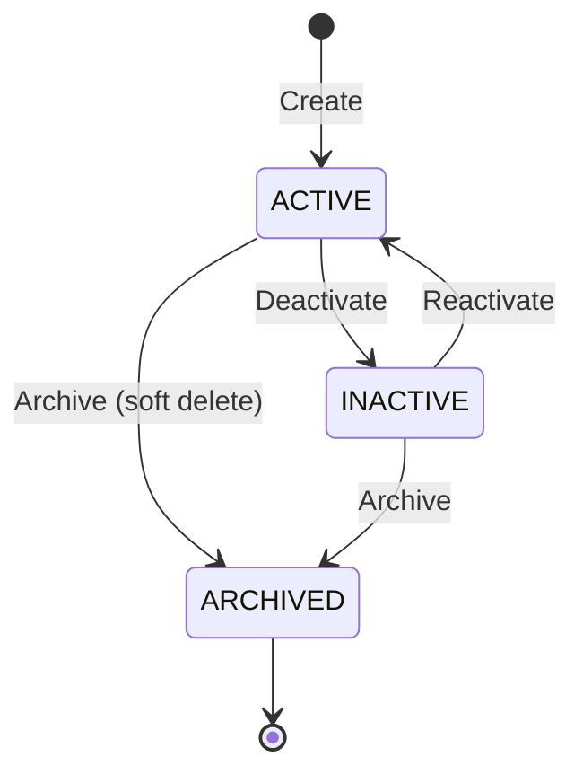

# Module 6.3 — Organization Structure

> Detail operasional modul Organization Structure
> Referensi utama: `prd.md` section 6.3, `fix-prd.md` section 3.3, `MODULE-DETAIL-GAP-GUIDE.md`
> Status: draft refinement
> Tanggal: 2026-06-30

---

## 1. Ringkasan

### Tujuan Bisnis

Organization Structure menjadi **sumber kebenaran tunggal (single source of truth)** untuk struktur formal organisasi perusahaan — dari level holding group hingga jabatan individual. Seluruh modul lain (Employee, Payroll, Attendance, Leave, Recruitment, Performance, Workflow, Reporting) mereferensi struktur ini untuk:

- memastikan data karyawan selalu terikat ke unit organisasi yang valid
- menyediakan hierarki atasan-bawahan untuk approval workflow
- memungkinkan filter dan agregasi data per departemen/divisi/company
- mendukung visualisasi interaktif struktur organisasi (org chart)

### Masalah yang Diselesaikan

- data departemen dan jabatan tersebar, tidak sinkron antar modul
- tidak ada riwayat perubahan struktur (restrukturisasi sulit dilacak)
- approval chain tidak bisa otomatis menentukan atasan karena data reporting line tidak terstruktur
- perusahaan grup/holding tidak punya representasi multi-company yang terpadu
- proses merger divisi atau pemindahan departemen berisiko merusak referensi data karyawan

### Dependency Modul

- `6.1 Authentication & Authorization` — role-based access
- `6.2 Master Employee` — penempatan karyawan di unit organisasi
- `6.4 Shift Management` — shift assignment per departemen/posisi
- `6.6 Attendance` — geofencing per branch
- `6.7 Leave Management` — approval chain per departemen
- `6.9 Payroll` — cost center & filter departemen
- `6.10 Performance Management` — review per departemen
- `6.14 Recruitment & ATS` — vacancy per departemen/posisi
- `6.23 Workflow Engine` — approval routing berbasis hierarki
- `6.11 Dashboard & Reporting` — agregasi per unit organisasi

---

## 2. Aktor dan Hak Akses

### Aktor Utama

- `Group Super Admin` — mengelola Company Group & Company
- `Super Admin` — mengelola Company & struktur di bawahnya
- `HR Manager` — mengelola Division, Department, Sub-Department, Position
- `HR Staff` — melihat struktur, mengedit metadata terbatas
- `Manager` — melihat struktur timnya sendiri
- `Employee` — melihat org chart read-only

### Akses Minimum per Role

| Role | Company Group | Company | Division | Department | Position | Org Chart |
|------|:---:|:---:|:---:|:---:|:---:|:---:|
| Group Super Admin | CRUD | CRUD | View | View | View | View All |
| Super Admin | View | CRUD | CRUD | CRUD | CRUD | View All |
| HR Manager | View | View | CRUD | CRUD | CRUD | View All |
| HR Staff | View | View | View | View | Edit metadata | View All |
| Manager | — | — | View | View tim | View tim | View tim |
| Employee | — | — | — | View | — | View self |

### Scope Akses

- seluruh query wajib difilter oleh `company_id` atau `group_id` sesuai akses user
- `Group Super Admin` bisa melihat dan mengelola seluruh company dalam group
- `Super Admin` dan `HR Manager` hanya terbatas pada company mereka sendiri
- Manager hanya melihat struktur departemen tempat dirinya dan timnya berada
- Employee hanya melihat posisi dirinya dalam org chart

### Menu Visibility

- `Group Super Admin` melihat menu "Group Settings" + "Company Group" + "Org Chart"
- `Super Admin` / `HR Manager` melihat "Organization" dengan submenu lengkap
- `Manager` melihat "Organization" terbatas (Chart + Departments tim saja)
- `Employee` tidak melihat menu Organization di sidebar (kecuali org chart publik)

---

## 3. Entitas dan Data

### Entitas Utama

| Entity | Deskripsi | Level |
|--------|-----------|-------|
| `CompanyGroup` | Holding/perusahaan induk | Group |
| `Company` | Badan hukum/legal entity | Company |
| `Branch` | Cabang/lokasi fisik | Company |
| `Division` | Divisi fungsional vertikal | Company |
| `Department` | Departemen di bawah divisi | Company |
| `SubDepartment` | Sub-departemen/tim | Department |
| `Position` | Jabatan individual | Department |

### Hierarki Lengkap (fix-prd §3.3)

```
Company Group (holding)
  └── Company (legal entity / PT)
        ├── Branch (cabang fisik)
        ├── Division (divisi)
        │     └── Department (departemen)
        │           ├── Sub-Department (tim)
        │           └── Position (jabatan + level/grade)
        └── Position (jabatan yang langsung di bawah company)
```

### Field Penting per Entity

**CompanyGroup:**
- `id`, `name`, `code`, `taxId` (NPWP holding)
- `address`, `phone`, `email`, `logo`, `website`
- `status` (ACTIVE / INACTIVE / ARCHIVED)

**Company:**
- `id`, `groupId`, `name`, `code`, `taxId` (NPWP)
- `address`, `phone`, `email`, `logo`, `website`
- `timezone`, `dateFormat`, `fiscalYearStart`, `currency`
- `status` (ACTIVE / INACTIVE / ARCHIVED)

**Branch:**
- `id`, `companyId`, `name`, `code`
- `address`, `phone`, `email`, `timezone`
- `latitude`, `longitude` (untuk geofencing)
- `status` (ACTIVE / INACTIVE / ARCHIVED)

**Division:**
- `id`, `companyId`, `name`, `code`
- `headId` (kepala divisi)
- `description`, `status`

**Department:**
- `id`, `divisionId`, `companyId`, `parentId`
- `name`, `code`, `headId` (kepala departemen)
- `description`, `costCenter`, `status`

**SubDepartment:**
- `id`, `departmentId`, `name`, `code`
- `headId` (kepala tim), `description`, `status`

**Position:**
- `id`, `departmentId`, `companyId`, `name`, `code`
- `gradeLevel`, `minSalary`, `maxSalary`
- `reportsToId` (atasan langsung)
- `description`, `requirements`, `status`

### Data Sensitif

- struktur gaji per posisi (`minSalary`, `maxSalary`) — hanya untuk HR Manager/Finance
- cost center departemen — terkait alokasi budget

### Relasi Penting

- Employee terikat ke `departmentId`, `positionId`, `branchId`
- Position memiliki `reportsToId` untuk hierarki atasan-bawahan
- Department memiliki `parentId` untuk sub-department
- Department memiliki `costCenter` yang direferensi Payroll
- Approval chain workflow bisa menggunakan `headId` departemen sebagai approver default

---

## 4. Status

### Status Entity

Semua entity organisasi menggunakan status yang sama:

| Status | Arti |
|--------|------|
| `ACTIVE` | Struktur aktif dan bisa digunakan |
| `INACTIVE` | Dinonaktifkan sementara, karyawan tidak bisa ditempatkan |
| `ARCHIVED` | Struktur historis, tidak bisa diedit |

### Transisi Status



### Locking Rule

- Entity yang masih memiliki **karyawan aktif** tidak bisa diubah ke INACTIVE atau ARCHIVED
- Entity yang memiliki **child entity aktif** tidak bisa dihapus / diarsipkan
- Company tidak bisa dihapus dari group jika masih memiliki data transaksional (payroll, attendance, leave)
- Perubahan pada struktur yang sudah dipakai payroll final bersifat locked untuk periode tersebut

---

## 5. Alur Utama

### A. Onboarding Company Baru ke dalam Group (fix-prd §3.3)

1. Group Super Admin membuka menu "Company Group" → "Tambah Company".
2. Sistem menanyakan: company baru ini independent atau bagian dari Company Group?
3. **[Jika bagian dari grup]** → pilih Company Group existing, atau buat baru.
4. Group Super Admin mengisi profil Company baru: nama legal, NPWP, alamat, bidang usaha.
5. Sistem membuat struktur dasar kosong dan **menyalin (clone, opsional)** konfigurasi dari Company lain: template salary component, leave type, kalender libur nasional, policy group-wide.
6. HR Manager melanjutkan membuat Division → Department → Sub-Department → Position.
7. HR Manager menentukan **Kepala Unit/PIC** tiap departemen.
8. Sistem memvalidasi tidak ada *circular reporting*.
9. Org Chart interaktif ter-generate otomatis.
10. Setiap perubahan struktur tercatat di riwayat dan Audit Log.

### B. Restrukturisasi (Merge/Split Departemen)

1. HR Manager memilih departemen yang akan diubah.
2. Untuk merge: pilih departemen tujuan, konfirmasi pemindahan karyawan.
3. Untuk split: tentukan nama departemen baru, pindahkan sebagian karyawan.
4. Sistem memvalidasi tidak ada karyawan yang kehilangan departemen.
5. Departemen lama diubah statusnya menjadi ARCHIVED.
6. Riwayat perubahan tersimpan.

### C. Mutasi Karyawan Antar Unit

1. HR membuka halaman edit karyawan.
2. Mengubah department/position/branch karyawan.
3. Sistem mencatat riwayat mutasi (EmployeeCareerTransaction).
4. Notifikasi dikirim ke atasan lama dan baru.
5. Approval workflow dijalankan jika perubahan bersifat sensitif.

---

## 6. Alur Alternatif / Exception

### Restrukturisasi Gagal

- **Karyawan tidak terpindahkan:** sistem menolak penghapusan unit selama masih ada karyawan aktif
- **Sirkular reporting:** validasi mencegah atasan = bawahan secara langsung/tidak langsung

### Company Keluar dari Grup (Divestasi)

- `groupId` pada company diset NULL
- Riwayat historis (payroll, attendance, dsb.) tetap tersimpan
- Company berhenti muncul di laporan konsolidasi grup setelah tanggal efektif

### Duplicate Entity

- `code` bersifat unique — sistem menolak duplikasi kode entity dalam scope yang sama
- Nama boleh sama selama kode berbeda

### Conflict

- Dua admin mengedit struktur yang sama bersamaan
- Last-write-wins, tetapi ditandai di audit log
- UI menampilkan pesan jika data sudah berubah sejak halaman dibuka

---

## 7. Validasi dan Business Rules

### Validasi Struktur

- Hierarki wajib: Company Group → Company → Division → Department → Sub-Department → Position
- `code` bersifat unique dalam satu level entity dan scope (company/group)
- Entitas tidak bisa dihapus jika masih memiliki anggota aktif
- `reportsToId` tidak boleh mengacu ke posisi yang sama (circular reference)

### Validasi Company Group

- Company bisa独立 (groupId = null) atau di bawah satu group
- Company dalam satu group harus punya kode unique dalam group tersebut
- Group tidak bisa dihapus jika masih memiliki company aktif

### Validasi Kepala Unit

- Kepala departemen harus merupakan karyawan aktif di departemen tersebut
- Satu orang bisa menjadi kepala beberapa unit (dengan catatan di audit)
- Kepala unit yang resign otomatis melepas jabatan kepalanya

### Rule Company Scope

- Seluruh query wajib difilter oleh `companyId` user
- Group role melihat data lintas company, tetapi hanya untuk operasi view
- Perubahan struktur oleh role company-level hanya terbatas pada company-nya sendiri

---

## 8. UI/UX

### Halaman Minimum

| Halaman | Deskripsi | Route |
|---------|-----------|-------|
| Org Chart | Visualisasi struktur interaktif | `/organization/chart` |
| Groups List | Daftar company group | `/organization/groups` |
| Companies List | Daftar company | `/organization/companies` |
| Departments List | Daftar departemen | `/organization/departments` |
| Positions List | Daftar jabatan | `/organization/positions` |

### Org Chart Page

- Mode **Group View**: perusahaan sebagai node, bisa expand ke departemen
- Mode **Company View**: struktur detail satu company
- Node bisa diklik untuk lihat detail unit & anggota
- Drag-and-drop untuk restrukturisasi (future)
- Pencarian unit/karyawan dalam chart

### List Pages

Masing-masing halaman list (Groups, Companies, Departments, Positions) mendukung:

- **Search** by name / code
- **Filter** by status (ACTIVE / INACTIVE / ARCHIVED)
- **Sort** by name / code / updatedAt
- **Pagination** (20 per page)
- **Create/Edit modal** dengan form validation
- **Delete** dengan confirm dialog + validasi constraint
- **Inline status badge** dengan warna berbeda per status

### Empty State

- "Belum ada company group. Buat group pertama untuk mulai."
- "Belum ada departemen. Tambah departemen untuk company ini."
- "Tidak ada hasil ditemukan untuk filter yang dipilih."
- "Unit ini tidak memiliki anggota."

### Loading State

- Skeleton cards/rows saat load data
- Spinner untuk operasi create/update/delete

### Error State

- Toast error untuk operasi gagal
- Inline validation error pada form modal
- Error banner jika org chart gagal dimuat
- "Anda tidak memiliki akses ke unit ini" untuk forbidden access

---

## 9. API Contract

### Endpoint yang Tersedia

| Method | Endpoint | Deskripsi |
|--------|----------|-----------|
| GET | `/api/organization/groups` | List company groups |
| POST | `/api/organization/groups` | Create group |
| GET | `/api/organization/groups/:id` | Detail group |
| PUT | `/api/organization/groups/:id` | Update group |
| DELETE | `/api/organization/groups/:id` | Delete group |
| GET | `/api/organization/companies` | List companies |
| POST | `/api/organization/companies` | Create company |
| GET | `/api/organization/companies/:id` | Detail company |
| PUT | `/api/organization/companies/:id` | Update company |
| DELETE | `/api/organization/companies/:id` | Delete company |
| GET | `/api/organization/departments` | List departments |
| POST | `/api/organization/departments` | Create department |
| GET | `/api/organization/departments/:id` | Detail department |
| PUT | `/api/organization/departments/:id` | Update department |
| DELETE | `/api/organization/departments/:id` | Delete department |
| GET | `/api/organization/positions` | List positions |
| POST | `/api/organization/positions` | Create position |
| GET | `/api/organization/positions/:id` | Detail position |
| PUT | `/api/organization/positions/:id` | Update position |
| DELETE | `/api/organization/positions/:id` | Delete position |
| GET | `/api/organization/chart` | Data org chart |

### Request Shape (Contoh)

```json
// POST /api/organization/departments
{
  "companyId": "uuid",
  "divisionId": "uuid (opsional)",
  "parentId": "uuid (opsional)",
  "name": "Human Capital",
  "code": "HC",
  "headId": "uuid (opsional)",
  "description": "Departemen Sumber Daya Manusia",
  "costCenter": "CC-HC-001"
}
```

### Response Shape

```json
{
  "success": true,
  "data": {
    "id": "uuid",
    "name": "Human Capital",
    "code": "HC",
    "head": { "id": "uuid", "fullName": "Budi Santoso" },
    "children": [ ... ],
    "employeeCount": 15,
    "status": "ACTIVE"
  }
}
```

### Error yang Mungkin Muncul

| HTTP | Code | Skenario |
|------|------|----------|
| 400 | VALIDATION_ERROR | Field wajib tidak diisi, kode duplikat |
| 401 | UNAUTHORIZED | Belum login |
| 403 | FORBIDDEN | Tidak punya akses ke company/group ini |
| 404 | NOT_FOUND | Entity tidak ditemukan |
| 409 | CONFLICT | Masih memiliki anggota aktif |
| 422 | CIRCULAR_REFERENCE | Reporting line sirkular |
| 500 | INTERNAL_ERROR | Gagal menyimpan perubahan |

---

## 10. Workflow / Approval

### Perubahan Struktur yang Perlu Approval

| Jenis Perubahan | Approver yang Disarankan |
|----------------|--------------------------|
| Create Company Baru | Group Super Admin (wajib) |
| Hapus/Merge Departemen | HR Manager + Company Admin |
| Ubah Kepala Unit | HR Manager (approval otomatis via system) |
| Ubah Reporting Line | HR Manager |
| Divestasi Company dari Group | Group Super Admin + Legal |

### Alur Approval

- Pembuatan company baru: `Group Super Admin` membuat langsung (final)
- Perubahan struktural besar: melalui Workflow Engine dengan template "Org Restructure"
- Perubahan reporting line: cukup approval HR Manager (tidak perlu workflow engine untuk kasus sederhana)

### SLA

- Perubahan struktur rutin: 1 hari kerja
- Restrukturisasi besar: 3-5 hari kerja (melalui rapat koordinasi)

---

## 11. Notification

### Trigger

| Event | Penerima | Channel |
|-------|----------|---------|
| Company baru dibuat | Group Super Admin, HR Manager | In-app, Email |
| Departemen diubah/dihapus | Semua anggota departemen | In-app |
| Kepala unit diubah | Kepala unit lama & baru | In-app, Email |
| Karyawan dipindahkan | Karyawan, atasan lama & baru | In-app, Email |
| Struktur diarsipkan | HR Manager company | In-app |

---

## 12. Audit Log

### Aksi yang Wajib Di-log

| Aksi | Detail |
|------|--------|
| CREATE entity | Actor, entity type, entity ID, timestamp |
| UPDATE entity | Actor, field before/after |
| DELETE / ARCHIVE entity | Actor, entity detail, reason |
| MOVE department | Actor, parent before/after |
| CHANGE head | Actor, old head, new head |
| MERGE departments | Actor, source, target, employee list |
| TRANSFER company | Actor, old group, new group |

### Data yang Dimasking

- Data gaji per posisi (`minSalary`, `maxSalary`) — log hanya mencatat "salary range updated" tanpa nilai
- Informasi kepemilikan company — tidak muncul di log akses role non-privileged

---

## 13. Reporting

### Dashboard / Widget

| Widget | Sumber Data | Role |
|--------|-------------|------|
| Jumlah karyawan per departemen | Department + Employee | HR Manager, Manager |
| Jumlah karyawan per company | Company + Employee | Group Super Admin |
| Struktur tree per company | Org Chart data | Super Admin, HR Manager |
| Departemen tanpa kepala | Department | HR Manager |
| Headcount perubahan per bulan | EmployeeCareerTransaction | HR Manager |

### Export

- Daftar departemen per company (CSV)
- Daftar posisi per departemen (CSV)
- Struktur organisasi lengkap (PDF)
- Employee list per departemen (CSV/Excel, integrasi ke Module Employee)

---

## 14. Seed / Demo Scenario

### Data Minimum

| Entity | Jumlah | Catatan |
|--------|:------:|---------|
| Company Group | 1 | "PT Indah Karya Grup" |
| Company | 2 | "PT Indah Karya Utama", "PT Indah Karya Digital" |
| Division | 2-3 | "Finance", "Operations", "Technology" |
| Department | 4-6 | "HR", "Finance", "IT", "Marketing" per company |
| Sub-Department | 2-3 | "Payroll", "Recruitment" di bawah HR |
| Position | 8-12 | "HR Manager", "Staff Accountant", "Software Engineer", dll |
| Branch | 2 | "Jakarta Pusat", "Bandung" |

### Happy Path

1. Group Super Admin login → lihat org chart group view → semua company muncul
2. HR Manager masuk ke company → tambah department baru → muncul di chart
3. Karyawan baru ditempatkan ke department → data otomatis mereferensi struktur
4. Manager lihat struktur timnya → klik node → lihat anggota
5. HR mengganti kepala departemen → notifikasi terkirim

### Reject Path

1. HR coba hapus departemen yang masih punya karyawan → sistem tolak dengan pesan
2. Coba buat department dengan kode duplikat → validasi error
3. Position reportsToId mengacu ke dirinya sendiri → circular reference ditolak

---

## 15. Open Questions

1. Apakah org chart perlu mendukung export PDF untuk keperluan legal/laporan?
2. Apakah struktur matrix organization (multiple reporting lines) perlu didukung?
3. Apakah branch bisa dimiliki oleh lebih dari satu company (shared branch)?
4. Apakah perlu approval workflow untuk perubahan struktur yang berdampak luas?
5. Apakah perlu fitur "restrukturisasi simulasi" sebelum diaktifkan?
6. Apakah Company Group bisa nested (sub-holding dalam holding)?

---

## 16. Acceptance Criteria

- [ ] CRUD Company Group berfungsi penuh dengan validasi
- [ ] CRUD Company berfungsi dengan validasi scope group
- [ ] CRUD Division, Department, Sub-Department, Position dengan validasi hierarki
- [ ] Entity tidak bisa dihapus jika masih memiliki anggota/child aktif
- [ ] Circular reporting terdeteksi dan ditolak
- [ ] Org Chart interaktif menampilkan data real-time
- [ ] Dua mode org chart: Group View dan Company View
- [ ] Riwayat perubahan struktur tercatat di audit log
- [ ] Role-based access control berfungsi (Group Admin vs Company Admin)
- [ ] Company cloning untuk akselerasi setup company baru
- [ ] Seed data menampilkan struktur yang realistis
- [ ] Semua empty state, loading state, dan error state terimplementasi

---

## 17. Scope Implementasi Bertahap

### Phase 1 (✅ Selesai)

- CRUD Company Group, Company, Department, Position
- Validasi hierarki dasar
- Role-based filtering
- Org Chart dasar (tree view)
- Seed data minimum

### Phase 2

- Branch management + geofencing integration
- Org Chart interaktif dengan klik node
- Employee count per unit
- Cost center integration ke Payroll

### Phase 3

- Drag-and-drop restrukturisasi
- Simulasi restrukturisasi
- Split/Merge department wizard
- Integrasi Workflow Engine untuk approval perubahan struktur
- Export org chart (PDF/PNG)
- Group-level dashboard konsolidasi

---

## 18. Catatan Implementasi

Organization Structure adalah modul **fondasi** yang paling banyak direferensi oleh modul lain. Kesalahan data di sini akan berdampak ke seluruh sistem. Oleh karena itu:

- Selalu validasi referensial integrity sebelum mengubah struktur
- Jangan izinkan hard delete — selalu soft delete/archive
- Audit log harus detail untuk memudahkan investigasi jika terjadi kesalahan data
- Cache org chart data untuk performa, tetapi invalidate cache saat ada perubahan struktur
- Pertimbangkan versioning struktur untuk keperluan histori payroll dan reporting
- Untuk implementasi di production, pertimbangkan materialized path atau nested set untuk query hierarki yang efisien
