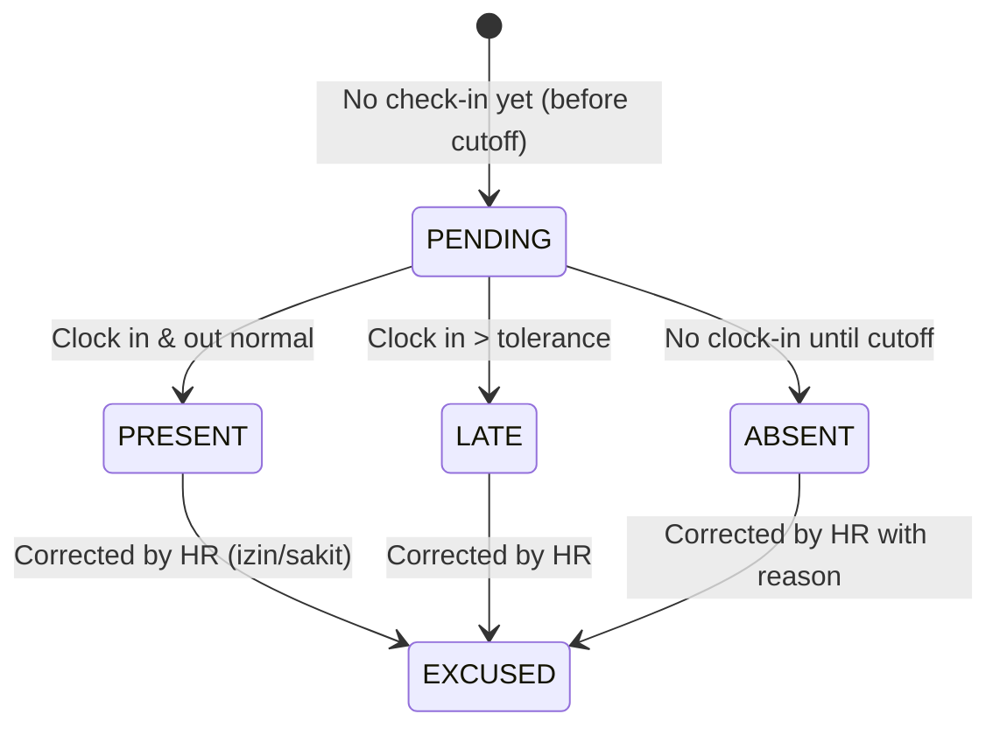
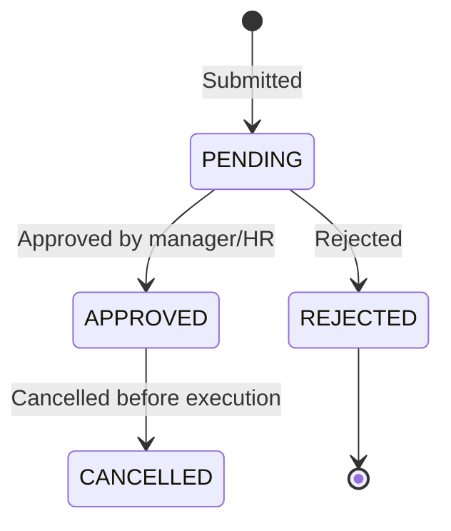

# Module 6.6 — Attendance

> Detail operasional modul Attendance
> Referensi utama: `prd.md` section 6.6, `fix-prd.md` section 3.6, `MODULE-DETAIL-GAP-GUIDE.md`
> Status: draft refinement
> Tanggal: 2026-06-30

---

## 1. Ringkasan

### Tujuan Bisnis

Modul Attendance mencatat dan memvalidasi kehadiran karyawan harian melalui berbagai metode, menjadi **basis perhitungan payroll** (tunjangan kehadiran, potongan ketidakhadiran, lembur) dan **evaluasi kedisiplinan** (tingkat keterlambatan, ketidakhadiran).

### Masalah yang Diselesaikan

- data kehadiran tidak akurat karena tidak ada sistem terpusat
- perhitungan tunjangan kehadiran dan potongan masih manual
- deteksi keterlambatan, lembur, dan anomali tidak otomatis
- koreksi absensi tidak memiliki audit trail
- rekap kehadiran tidak sinkron dengan Work Calendar (libur nasional dihitung absen)

### Dependency Modul

- `6.2 Master Employee` — data karyawan
- `6.3 Organization Structure` — branch untuk geofencing
- `6.4 Shift Management` — jam kerja rujukan
- `6.5 Work Calendar` — penentuan hari wajib hadir
- `6.7 Leave Management` — status cuti/izin meniadakan status absen
- `6.8 Self Service Request` — koreksi absensi
- `6.9 Payroll` — perhitungan tunjangan & potongan
- `6.12 Notification & Alert` — reminder clock-in, anomaly alert
- `6.13 Audit Log` — catatan perubahan data

---

## 2. Aktor dan Hak Akses

### Aktor Utama

- `Employee` — clock in/out via mobile/QR, lihat riwayat sendiri
- `Manager` — lihat kehadiran anggota tim, approve koreksi
- `HR Staff` — input manual/koreksi, lihat rekap semua karyawan
- `HR Manager` — semua akses, approval koreksi
- `Super Admin / Group Super Admin` — semua akses, konfigurasi

### Akses Minimum per Role

| Role | Clock In/Out | View Self | View Team | View All | Koreksi | Approval Koreksi | Konfigurasi |
|------|:-----------:|:---------:|:---------:|:--------:|:-------:|:----------------:|:-----------:|
| Employee | ✅ | ✅ | ❌ | ❌ | ❌ | ❌ | ❌ |
| Manager | ❌ | ✅ | ✅ | ❌ | ❌ | ✅ Tim | ❌ |
| HR Staff | ✅ Manual | ✅ | ✅ | ✅ | ✅ | ❌ | ❌ |
| HR Manager | ✅ Manual | ✅ | ✅ | ✅ | ✅ | ✅ | ✅ |
| Super Admin | ✅ | ✅ | ✅ | ✅ | ✅ | ✅ | ✅ |

### Scope Akses

- `Employee` hanya melihat data kehadiran dirinya sendiri
- `Manager` melihat data kehadiran anggota tim (berdasarkan department head)
- `HR Staff/HR Manager` melihat data seluruh karyawan di company-nya
- `Group Super Admin` melihat data seluruh company dalam group (agregasi)

### Menu Visibility

- `Employee` melihat menu "Attendance" yang berisi status clock-in hari ini + riwayat
- `Manager` melihat menu "Attendance" dengan tambahan "Team Attendance"
- `HR Staff/HR Manager` melihat menu penuh dengan rekap & laporan

---

## 3. Entitas dan Data

### Entitas Utama

| Entity | Deskripsi |
|--------|-----------|
| `Attendance` | Record kehadiran harian per karyawan |
| `OvertimeRequest` | Pengajuan lembur |

### Field Penting di Attendance

- `id`, `employeeId`, `companyId`, `date`
- `checkIn`, `checkOut` (timestamp)
- `status` (AttendanceStatus: PRESENT, ABSENT, LATE, EXCUSED)
- `workDuration` (menit), `lateMinutes`, `earlyLeaveMinutes`
- `notes`, `createdAt`, `updatedAt`, `deletedAt`

### Field Penting di OvertimeRequest

- `id`, `employeeId`, `companyId`, `date`
- `startTime`, `endTime`, `durationHours`
- `reason`, `multiplier` (1.5 default)
- `status` (PENDING, APPROVED, REJECTED, CANCELLED)
- `approvedBy`, `approvedAt`

### Status Kehadiran Lengkap

| Kode | Status | Kondisi |
|------|--------|---------|
| H (PRESENT) | Hadir | Clock in & out normal sesuai shift |
| T (LATE) | Terlambat | Clock in melewati toleransi |
| PL (EARLY_LEAVE) | Pulang Cepat | Clock out sebelum jam selesai |
| A (ABSENT) | Absen | Tidak ada catatan absensi |
| I (EXCUSED) | Izin | Disetujui via self-service request |
| S (EXCUSED) | Sakit | Disetujui dengan/tanpa surat dokter |
| C (EXCUSED) | Cuti | Disetujui via leave management |
| L | Lembur | Clock out melewati jam shift |
| LN | Libur Nasional | Hari libur nasional |

### Data Sensitif

- Data kehadiran karyawan terkait disiplin — tidak boleh diakses karyawan lain
- Data koreksi absensi dengan alasan — perlu proteksi privasi

### Relasi Penting

- Attendance → Employee (per karyawan per hari)
- Attendance → Company (scope company)
- OvertimeRequest → Employee (pengajuan lembur)
- OvertimeRequest → Company (scope company)
- Attendance → Work Calendar (penentuan hari libur)
- Attendance → Leave Management (cuti/izin mengubah status)

---

## 4. Status

### Status Attendance



### Status OvertimeRequest



### Locking Rule

- Rekap bulanan dikunci setelah tanggal cutoff payroll
- Data attendance yang sudah dipakai payroll final tidak bisa diedit
- Koreksi attendance untuk periode terkunci perlu approval khusus

---

## 5. Alur Utama

### A. Clock In/Out via Mobile (fix-prd §3.6)

1. Karyawan membuka mobile app pada jam kerja, tekan "Clock In".
2. Aplikasi mengambil lokasi GPS perangkat.
3. **[Jika selfie wajib diaktifkan]** → aplikasi meminta foto selfie.
4. Data (waktu, lokasi, foto) dikirim ke server.
5. Sistem memvalidasi lokasi terhadap radius geofencing **Branch** tempat karyawan ditugaskan.
6. Sistem mengecek Work Calendar: jika hari ini bukan hari kerja (libur), ditandai sebagai kehadiran di luar jadwal.
7. Sistem membandingkan waktu clock-in dengan jam mulai shift + toleransi → tentukan status H atau T.
8. Record tersimpan; status real-time di Dashboard.
9. Proses serupa saat Clock Out, dengan deteksi Lembur (L) jika clock-out > jam shift + toleransi, atau Pulang Cepat (PL) jika < jam selesai.
10. Jika tidak clock-in sampai batas waktu, sistem otomatis tandai Absen (A) — kecuali hari libur/cuti/izin yang sudah disetujui.

### B. Check In Manual oleh HR

1. HR Staff membuka Attendance → "Manual Entry".
2. Pilih employee, tanggal, jam check-in dan check-out.
3. Pilih status (Hadir/Terlambat/Izin/Sakit, dll).
4. Isi alasan koreksi.
5. Sistem menyimpan dengan catatan "input manual by HR".
6. Audit log tercatat.

### C. Overtime Request (Lembur)

1. Karyawan atau HR mengajukan lembur via form.
2. Input tanggal, start time, end time, reason.
3. Sistem menghitung durasi otomatis.
4. Approval oleh Manager/HR Manager.
5. Jika disetujui, data lembur tersedia untuk payroll.
6. Hitungan lembur: multiplier × jam lembur × upah per jam.

### D. Koreksi Absensi

1. Karyawan atau HR membuka menu "Koreksi Absensi".
2. Pilih tanggal yang akan dikoreksi.
3. Pilih status baru (dari Absen → Hadir, misalnya).
4. Isi alasan dan upload bukti pendukung (foto, surat dokter, dll).
5. **[Jika perlu approval]** → approval manager/HR Manager via Workflow Engine.
6. Setelah disetujui, status attendance diperbarui.
7. Audit log mencatat before/after.

---

## 6. Alur Alternatif / Exception

### Mode Offline (Mobile)

- Data clock-in/out tersimpan lokal di perangkat
- Sinkronisasi otomatis saat koneksi tersedia
- Jika konflik data (jam server vs jam lokal berbeda), **server-side wins**
- Data offline ditandai "synced_from_local" di audit

### Lokasi di Luar Radius Geofencing

- Clock-in tetap bisa disubmit
- Ditandai "Perlu Review"
- Notifikasi ke HR untuk verifikasi manual
- Tidak otomatis ditolak (mengakomodasi dinas luar/WFH)

### Lupa Clock In/Out

- Karyawan lupa clock-in → HR melakukan koreksi manual
- Karyawan lupa clock-out → sistem bisa auto-clockout berdasarkan jam shift + toleransi, atau HR input manual
- Koreksi lupa absen memerlukan alasan tertulis

### Anomali

- **Double check-in:** sistem mendeteksi dua clock-in dalam waktu < 5 menit → validasi
- **Check-in tanpa check-out:** jika tidak ada clock-out hingga 2 jam setelah shift selesai, sistem auto-clockout
- **Lokasi mencurigakan:** jika lokasi GPS jauh dari branch, flag untuk review
- **Lembur mencurigakan:** jika jam lembur > batas wajar (misal > 4 jam/hari), flag untuk approval khusus

### Conflicting Leave

- Karyawan clock-in di hari yang sudah tercatat cuti → sistem bertanya: override atau batalkan?
- Jika approval override diberikan, status cuti dibatalkan untuk hari tersebut

---

## 7. Validasi dan Business Rules

### Validasi Clock In/Out

- Satu karyawan hanya bisa memiliki satu record attendance per hari
- Clock-out tidak bisa dilakukan sebelum clock-in
- Clock-out tidak bisa dilakukan di hari yang berbeda (kecuali shift malam)
- Waktu clock-in tidak boleh di masa depan

### Validasi Geofencing

- Radius geofencing dikonfigurasi per branch (dalam meter)
- Pengecekan menggunakan latitude/longitude branch vs GPS device
- Mode off-radius: clock-in tetap diterima dengan flag "out_of_radius"

### Validasi Lembur

- Lembur minimal 1 jam
- Lembur maksimal 4 jam per hari (atau sesuai policy company)
- Total lembur per minggu tidak melebihi batas regulasi (14 jam/minggu)

### Business Rules

- **Hari libur:** sistem tidak membuat record "Absen" pada hari yang dikategorikan libur di Work Calendar
- **Cutoff payroll:** rekap attendance dikunci setelah cutoff tanggal tertentu (tiap tanggal 25, misalnya)
- **Toleransi keterlambatan:** dapat dikonfigurasi per company (default 15 menit)
- **Auto-absen:** sistem menandai "Absen" jika tidak ada clock-in hingga jam XX:XX (konfigurabel)

### Rule Company Scope

- Setiap company memiliki konfigurasi attendance sendiri (geofencing radius, metode absensi, toleransi)
- Karyawan secondment menggunakan branch tempat penugasan sementara

---

## 8. UI/UX

### Halaman Minimum

| Halaman | Route | Fungsi |
|---------|-------|--------|
| Attendance List | `/attendance` | Rekap kehadiran dengan filter |
| Check In Manual | (modal di list) | Input manual oleh HR |
| Overtime List | (tab/accordion di list) | Daftar & pengajuan lembur |
| Attendance Report | `/attendance/report` | Laporan untuk export |

### List Page

- **Filter** by date range, department, employee, status
- **Search** by employee name / NIK
- **Calendar view** (yang menunjukkan status per hari per warna)
- **Table view** dengan columns: Tanggal, Nama, Check In, Check Out, Status, Durasi
- **Color-coded status badges**:
  - PRESENT: hijau
  - LATE: kuning
  - ABSENT: merah
  - EXCUSED (Izin/Sakit/Cuti): biru
  - LEMBUR: ungu
- **Actions**: Clock In (manual), koreksi per row
- **Pagination** atau infinite scroll

### Detail Page

- Header: Nama karyawan, NIK, department
- Calendar mini untuk navigasi tanggal
- Daily detail: jam check-in/out, durasi, status, lokasi
- Overtime list (jika ada)
- Koreksi history (jika pernah dikoreksi)
- Action: Request koreksi

### Check In/Out Manual (Modal)

- Pilih employee (dropdown + search)
- Pilih tanggal (default hari ini)
- Input jam check-in
- Input jam check-out (opsional, bisa diisi nanti)
- Pilih status (Hadir/Terlambat/Izin/Sakit)
- Alasan koreksi (wajib jika mengubah status)
- Tombol: Simpan / Batal

### Overtime Form (Modal)

- Pilih employee
- Pilih tanggal
- Input start time, end time (duration auto-calculate)
- Reason (wajib)
- Approval notification (jika perlu approve)

### Empty State

- "Belum ada data attendance. Karyawan perlu melakukan clock-in."
- "Tidak ada lembur untuk periode ini."
- Tidak ada hasil untuk filter yang dipilih.

### Loading State

- Skeleton table rows
- Spinner pada modal saat submit
- Loading indicator saat refresh data

### Error State

- "Gagal clock-in. Periksa koneksi dan lokasi Anda."
- "Karyawan sudah memiliki record attendance untuk tanggal ini."
- "Lokasi di luar radius geofencing. Clock-in tetap dicatat untuk review."
- "Gagal memuat data attendance."

---

## 9. API Contract

### Endpoint yang Tersedia

| Method | Endpoint | Deskripsi |
|--------|----------|-----------|
| GET | `/api/attendance` | List attendance (filter by employee, date range, status) |
| POST | `/api/attendance` | Check in / create record |
| GET | `/api/attendance/:id` | Detail attendance record |
| PATCH | `/api/attendance/:id/checkout` | Check out |
| PATCH | `/api/attendance/:id/correction` | Koreksi absensi |
| GET | `/api/attendance/summary` | Rekap bulanan |
| GET | `/api/attendance/report` | Laporan export |
| GET | `/api/attendance/overtime` | List overtime requests |
| POST | `/api/attendance/overtime` | Create overtime request |
| PATCH | `/api/attendance/overtime/:id/approve` | Approve overtime |
| PATCH | `/api/attendance/overtime/:id/reject` | Reject overtime |

### Request Check In

```json
POST /api/attendance
{
  "employeeId": "uuid",
  "companyId": "uuid",
  "date": "2026-06-30",
  "checkIn": "2026-06-30T08:00:00Z",
  "latitude": -6.21462,
  "longitude": 106.84513,
  "selfie": "base64_encoded_image (opsional)",
  "method": "QR" // atau GPS, MANUAL, FACE_RECOGNITION
}
```

### Request Check Out

```json
PATCH /api/attendance/:id/checkout
{
  "checkOut": "2026-06-30T17:00:00Z",
  "latitude": -6.21462,
  "longitude": 106.84513
}
```

### Response Shape

```json
{
  "success": true,
  "data": {
    "id": "uuid",
    "employee": { "id": "uuid", "fullName": "Budi Santoso", "employeeNumber": "202606-001" },
    "date": "2026-06-30",
    "checkIn": "2026-06-30T08:00:00Z",
    "checkOut": "2026-06-30T17:00:00Z",
    "status": "PRESENT",
    "workDuration": 480,
    "lateMinutes": 0,
    "earlyLeaveMinutes": 0,
    "method": "QR",
    "locationVerified": true,
    "notes": null
  }
}
```

### Error yang Mungkin Muncul

| HTTP | Code | Skenario |
|------|------|----------|
| 400 | VALIDATION_ERROR | Data tidak valid |
| 400 | DUPLICATE_ATTENDANCE | Sudah ada record untuk tanggal ini |
| 401 | UNAUTHORIZED | Belum login |
| 403 | FORBIDDEN | Tidak punya akses ke karyawan ini |
| 404 | NOT_FOUND | Record tidak ditemukan |
| 422 | OUT_OF_RADIUS | Lokasi di luar geofencing (clock-in tetap diterima) |
| 422 | LATE_CLOCK_IN | Clock-in melewati toleransi |
| 409 | PAYROLL_LOCKED | Periode sudah dikunci payroll |

---

## 10. Workflow / Approval

### Yang Perlu Approval

| Jenis | Approver | Workflow Engine |
|-------|----------|:---------------:|
| Koreksi absensi (ubah status) | Manager / HR Manager | ✅ Opsional untuk koreksi sederhana |
| Overtime > 4 jam | HR Manager | ✅ |
| Koreksi untuk periode terkunci (post-cutoff) | HR Manager | ✅ |
| Multiple correction dalam 1 bulan | HR Manager | ✅ |
| Koreksi dengan perubahan selisih > 2 jam | Manager | ✅ |

### Alur Approval

- Koreksi sederhana: `HR Staff input → langsung tersimpan (tanpa approval)`
- Koreksi dengan perubahan status: `HR Staff input → Manager approve`
- Koreksi post-cutoff: `HR Staff input → HR Manager approve`

### SLA

- Koreksi absensi: 1 hari kerja
- Overtime approval: 1 hari kerja

---

## 11. Notification

### Trigger

| Event | Penerima | Channel |
|-------|----------|---------|
| Clock-in berhasil | Karyawan | In-app (toast) |
| Belum clock-in (pengingat H-30 menit) | Karyawan | In-app, Push |
| Location out of radius | HR Staff | In-app |
| Koreksi absensi diajukan | Manager | In-app, Email |
| Koreksi absensi disetujui/ditolak | Karyawan, HR Staff | In-app |
| Overtime approved/rejected | Karyawan | In-app |
| Rekapan absensi siap (akhir bulan) | HR Manager | In-app, Email |
| Anomali absensi terdeteksi | HR Staff | In-app |

---

## 12. Audit Log

### Aksi yang Wajib Di-log

| Aksi | Detail |
|------|--------|
| Clock In | Employee, timestamp, method, location |
| Clock Out | Employee, timestamp, location |
| Manual Input by HR | HR actor, employee, before/after |
| Koreksi Status | HR actor, status before → after, reason |
| Overtime Create | Employee, hours, reason |
| Overtime Approve/Reject | Approver, decision |
| Lock/Unlock Period | HR Manager, period |

### Data yang Dimasking

- Foto selfie tidak boleh disimpan di log (hanya di record attendance)
- Lokasi GPS tidak muncul di view non-HR
- Alasan koreksi bersifat internal HR — tidak untuk konsumsi karyawan lain

---

## 13. Reporting

### Dashboard / Widget

| Widget | Sumber Data | Role |
|--------|-------------|------|
| Kehadiran hari ini (count) | Attendance (hari ini) | HR, Manager |
| % Kehadiran bulan ini | Attendance (bulanan) | HR Manager |
| Keterlambatan tertinggi | Attendance (top N late) | HR Manager |
| Karyawan tanpa clock-in hari ini | Attendance | HR Staff |
| Overtime bulan ini | OvertimeRequest | HR Manager |
| Tren kehadiran per bulan | Attendance | HR Manager |
| Attendance summary per departemen | Attendance + Department | HR Manager |

### Export

- Rekap kehadiran harian (CSV/Excel)
- Rekap kehadiran bulanan (CSV/PDF)
- Laporan keterlambatan (CSV)
- Laporan lembur (CSV)
- Kartu absensi per karyawan (PDF)

---

## 14. Seed / Demo Scenario

### Data Minimum

| Entity | Jumlah | Catatan |
|--------|:------:|---------|
| Attendance records | 200 | 10 karyawan × 20 hari kerja |
| Status PRESENT | 150 | Sebagian besar hadir |
| Status LATE | 20 | Beberapa terlambat |
| Status ABSENT | 10 | Beberapa tidak hadir |
| Status EXCUSED | 20 | Izin, sakit, cuti |
| OvertimeRequest | 10 | Beberapa lembur |
| Overtime APPROVED | 7 | Lembur disetujui |
| Overtime PENDING | 3 | Lembur menunggu approval |

### Happy Path

1. Karyawan buka mobile app → clock-in dengan GPS → toast success
2. HR lihat attendance list → filter "Late" → lihat 20 keterlambatan
3. Manager approve overtime → status jadi "Approved"
4. HR buka manual entry → input absensi karyawan yang lupa clock-in
5. HR export rekap bulanan → dapat file Excel

### Reject Path

1. Karyawan coba clock-in ganda → sistem tolak "Sudah ada record hari ini"
2. Karyawan clock-out tanpa clock-in → sistem tolak "Belum clock-in"
3. HR coba koreksi periode terkunci → sistem tolak "Periode sudah dikunci payroll"

---

## 15. Open Questions

1. Apakah perlu integrasi face recognition sebagai metode absensi tambahan?
2. Apakah mode offline mobile perlu prioritas untuk implementasi?
3. Bagaimana handling multiple shift (shift malam yang melewati tengah malam)?
4. Apakah perlu deteksi "anomali kebiasaan" (misal pola keterlambatan rutin)?
5. Bagaimana threshold auto-clockout jika karyawan lupa clock-out?
6. Apakah perlu integrasi dengan device fisik (mesin fingerprint, kartu RFID)?

---

## 16. Acceptance Criteria

- [ ] Clock-in dan clock-out berfungsi dengan validasi (employee + date unique)
- [ ] Deteksi status otomatis: Hadir, Terlambat, Absen berdasarkan jam shift
- [ ] Validasi geofencing (radius per branch)
- [ ] Location out-of-radius tetap dicatat dengan flag
- [ ] Manual entry oleh HR berfungsi
- [ ] Koreksi absensi dengan alasan tersimpan
- [ ] Overtime request + approve/reject berfungsi
- [ ] Auto-absen jika tidak clock-in hingga cutoff time
- [ ] Tidak membuat record absen di hari libur (Work Calendar)
- [ ] Filter & search attendance list berfungsi
- [ ] Role-based access (Employee vs Manager vs HR)
- [ ] Export rekap berfungsi
- [ ] Lock period post-payroll cutoff
- [ ] Seed data menampilkan dataset 1-2 bulan

---

## 17. Scope Implementasi Bertahap

### Phase 1 (✅ Selesai)

- CRUD Attendance dasar
- Manual check-in/check-out
- Attendance list dengan filter
- Overtime request + approval
- Overtime list
- Export dasar

### Phase 2

- Geofencing validation + out-of-radius flag
- Mobile clock-in/out via GPS
- Auto-absen detection
- QR Code atau NFC untuk scan
- Auto-clockout untuk lupa clock-out
- Dashboard widget kehadiran

### Phase 3

- Face recognition integration
- Mode offline mobile + sync
- Correction approval workflow (via Workflow Engine)
- Advanced anomaly detection
- Payroll lock integration
- Multiple shift handling (shift malam)

---

## 18. Catatan Implementasi

Attendance adalah modul yang **paling sering diinteraksi oleh karyawan** setiap hari. Keandalan dan kecepatan sistem sangat penting.

- Mobile app harus bisa offline-first — koneksi internet tidak selalu stabil
- GPS validation jangan terlalu ketat — akomodasi kasus WFH dan dinas luar
- Integrasi dengan Work Calendar sangat kritis: pastikan tidak ada record "Absen" di hari libur
- Pastikan performance query untuk filter date range + department + employee
- Pertimbangkan caching untuk data real-time (dashboard kehadiran)
- Untuk perusahaan besar (500+ karyawan), pertimbangkan queue system untuk auto-absen detection
- Mode offline perlu conflict resolution strategy (server-side wins)
- Data attendance adalah data sensitif terkait disiplin — akses harus dibatasi sesuai role
